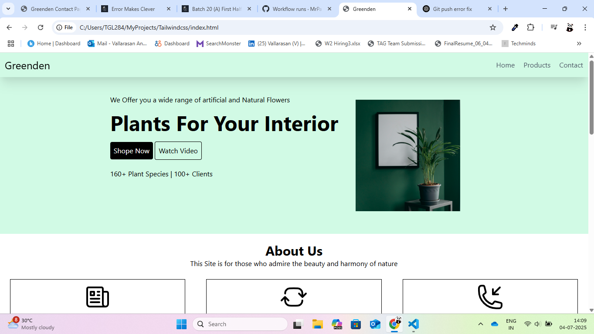
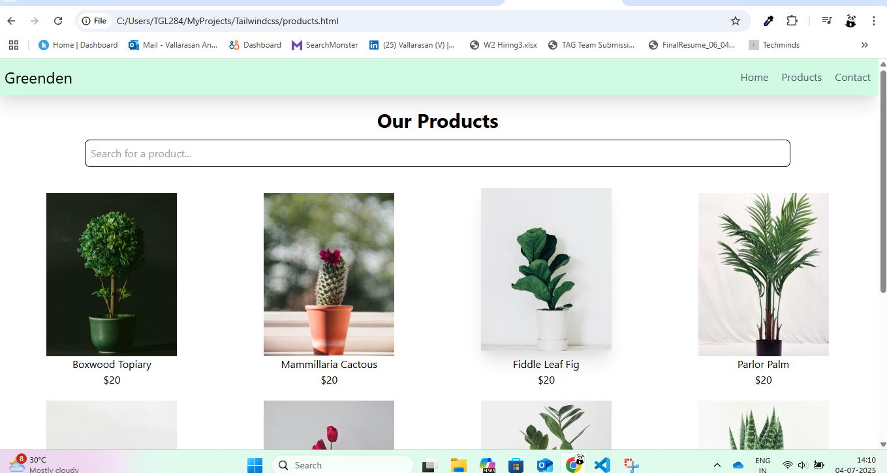
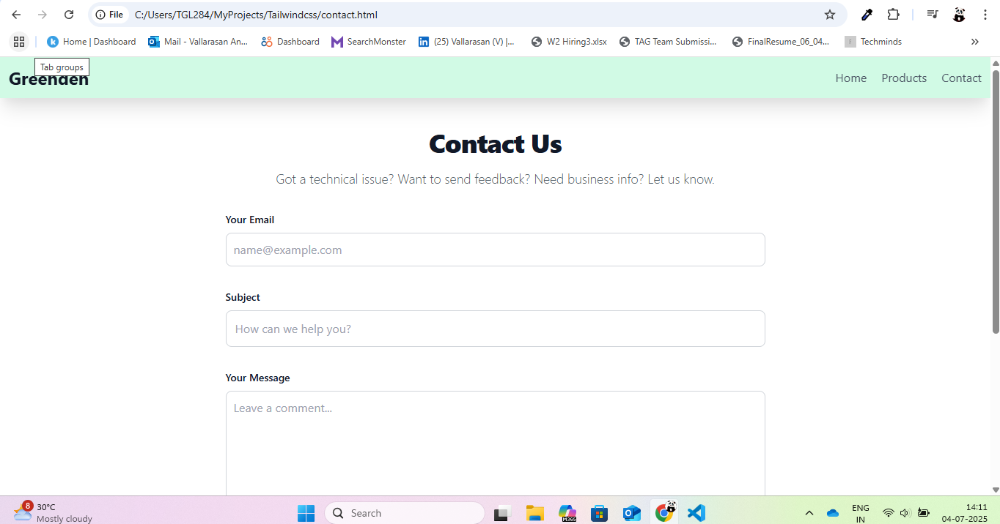

# 🌿 Greenden - Plant Store Website

Greenden is a responsive, clean, and simple plant store website built using **HTML** and **Tailwind CSS**. This project includes a homepage, a product listing page, and a contact page — perfect for showcasing indoor plants with a modern design.

---

## 📁 Project Structure

greenden-tailwind/
│
├── Images/              # All images used in the project
├── README.md            # Project overview and instructions
├── index.html           # Homepage
├── products.html        # Product listing page
├── tailwind.config.js   # Tailwind CSS configuration

---

## 🛠️ Technologies Used

- **HTML5**
- **Tailwind CSS**
- **Responsive Web Design**
- **Mobile-first design**

---

## ✅ Features

- ✅ Responsive navigation bar with mobile support
- ✅ Hero section with call-to-action buttons
- ✅ Best seller plant listings with hover effects
- ✅ Informative "About Us" section
- ✅ Contact form with styling
- ✅ Clean footer section

---

## 📸 Screenshots

>  
  
  

---

## 🚀 Getting Started

🌐 Live Demo
(https://mrpanda0427.github.io/greenden-tailwind/)

📩 Contact
Developed by Vallarasan Anbu (Mr. Panda)
📧 vallarasan.selvi28@gmail.com
📱 +91 7094769951

🪴 License
This project is for learning and personal use. Feel free to fork and modify!

